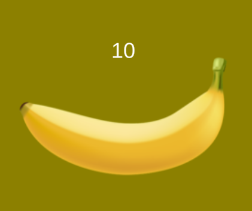

### Banana自动点击

> 七七七是娜娜娜，你怎么是八娜娜

#### 阅读本文你需要知道
 * python是最好的按钮精灵

#### 香蕉


我说真的，我真的不知道这个香蕉是怎么回事。

早上一到工作上，就看见大家都在发，我赶紧从stream上下载下来看看是怎么回事。

怎么回事，怎么回事都不是，就是点一下加一点一下加一，我寻思可能是要点N次以后会有变化吧，于是祭出我们无敌的cursor.

#### 自动点击脚本

新建一个空目录，创建一个空的main.py文件，开整：


cursor给我们写了下面代码：
```python
import pyautogui
import time

# Find the position of the Banana window
banana_window_position = pyautogui.locateOnScreen('banana_window.png')
if banana_window_position:
    # Move the cursor to the center of the Banana window
    banana_window_center = pyautogui.center(banana_window_position)
    pyautogui.click(banana_window_center)

    # Simulate clicking the Banana window 10000 times or until 'Z' is pressed
    for _ in range(10000):
        if pyautogui.press('z'):
            break
        pyautogui.click(banana_window_center)
        #time.sleep(0.001)  # Adding a short delay to avoid overwhelming the system
else:
    print("Banana window not found. Please make sure the window is visible on the screen.")

```

看他用到了`pyautogui`库，我们
```batch
pip install pyautogui
```
一下。

然后```python ./main.py```运行一下，发现报错了，说找不到banana_window.png

我寻思，我这边怎么没有这个图片，cursor给的图片在哪？哦cursor并没有给图片，cursor原来也不是无敌的。

我们截一下香蕉的图保存到当前目录下


大项告成~

