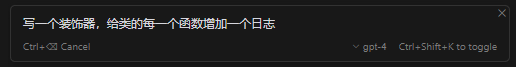
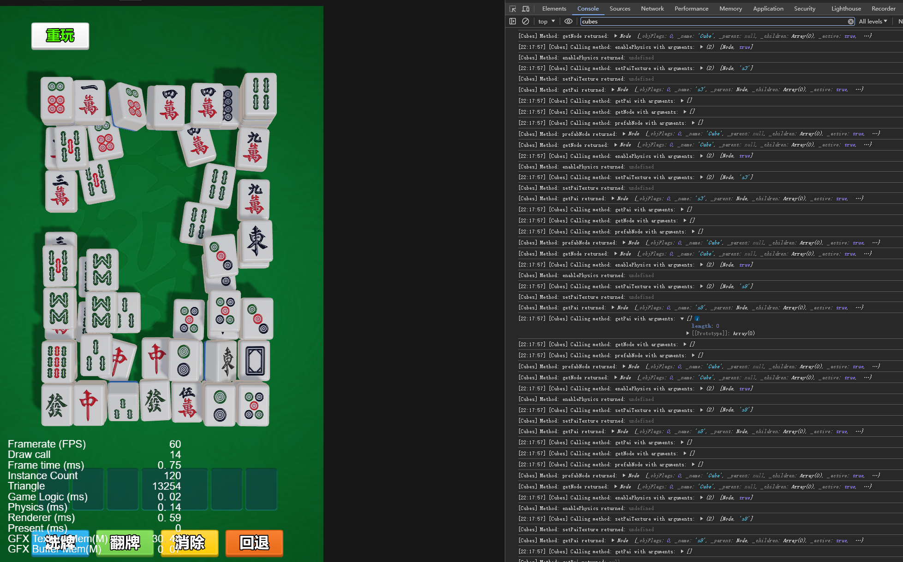

### 为所有函数调用增加日志

#### 阅读本文你需要
 * 会点typescript,听说过装饰器这个东西。
 * 了解一点cocoscreator

#### 3D麻将源码阅读

买了cocoscreator商店的3D麻将消除源，想一边操作一边看程序运行的逻辑，最好是能每一个函数调用都输出一行日志。

手动给每一个函数都增加日志是一个非常麻烦的工作。于是祭出CURSOR,让无敌的AI想想办法。

#### 使用装饰器

印象里装饰器可以完成类似工作。创建一个新文件`DebugHelper.ts`,输入提示词“写一个类装饰器，给类的每一个函数增加一个日志”



cursor会帮我们生成如下代码
```typescript
export function LogMethodCalls(label: string = "",excepts:string[] = []): ClassDecorator {
    return function (constructor: Function) {
        // Get all property names of the class
        const properties = Object.getOwnPropertyNames(constructor.prototype);

        properties.forEach(propertyName => {
           
            const lowcase = propertyName.toLocaleString();
            for(const except of excepts) {
                if(lowcase.includes(except)) {
                    return;
                }
            }
            
            const originalMethod = constructor.prototype[propertyName];


            // Check if the property is a function and not the constructor itself
            if (propertyName !== 'constructor' && typeof originalMethod === 'function') {
                // Replace the original method with a new function that includes logging
                constructor.prototype[propertyName] = function (...args: any[]) {
                    const currentTime = new Date().toLocaleTimeString();
                    console.log(`[${currentTime}] [${label}] Calling method: ${propertyName} with arguments:`, JSON.stringify(args));
                    const result = originalMethod.apply(this, args);
                    console.log(`[${label}] Method: ${propertyName} returned:`, result);
                    return result;
                };
            }
        });
    };
}

```
我们对代码进行一些小修改，比如不使用`JSON.stringify`，以防止对象存在循环引用
```typescript
export function LogMethodCalls(label: string = "",excepts:string[] = []): ClassDecorator {
    return function (constructor: Function) {
        // Get all property names of the class
        const properties = Object.getOwnPropertyNames(constructor.prototype);

        properties.forEach(propertyName => {
           
            const lowcase = propertyName.toLocaleString();
            for(const except of excepts) {
                if(lowcase.includes(except)) {
                    return;
                }
            }
            // 跳过get accesser 因为accessor的访问可能会访问未初始化属性            
            if (typeof Object.getOwnPropertyDescriptor(constructor.prototype, propertyName)?.get === 'function') {
                return;
            }
            
            const originalMethod = constructor.prototype[propertyName];


            // Check if the property is a function and not the constructor itself
            if (propertyName !== 'constructor' && typeof originalMethod === 'function') {
                // Replace the original method with a new function that includes logging
                constructor.prototype[propertyName] = function (...args: any[]) {
                    const currentTime = new Date().toLocaleTimeString();
                    console.log(`[${currentTime}] [${label}] Calling method: ${propertyName} with arguments:`, args);
                    const result = originalMethod.apply(this, args);
                    console.log(`[${label}] Method: ${propertyName} returned:`, result);
                    return result;
                };
            }
        });
    };
}

```


比如我们要给`Cubes`类增加日志：
```typescript
@LogMethodCalls("Cubes") //add a single line here
@ccclass('Cubes')
export class Cubes extends Component {
    //  impl
}
```
再次运行就会看到  console中输出了Cube类的所有方法调用



更多实用的AI实践，请关注

